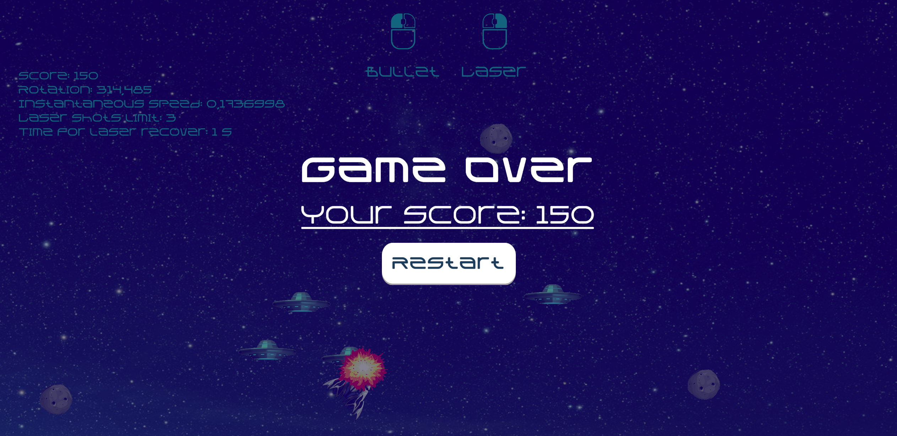
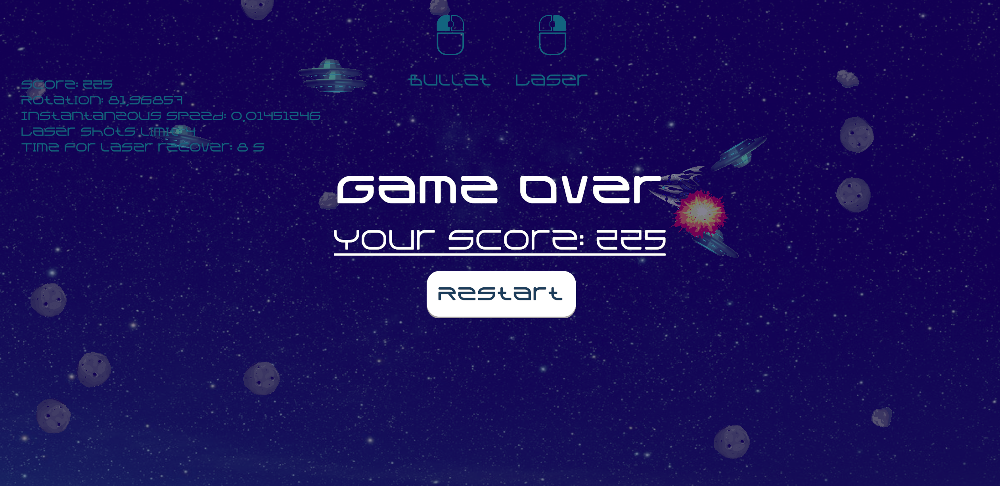

# Asteroids

2D игра, цель которой получить как можно больше очков, расстреливая астероиды и летающие тарелки, избегая при этом столкновения с ними. У движущегося корабля есть два вида оружия - пули и лазер. Пули при попадании в астероид разбивают его на обломки меньшего размера и полностью уничтожают летающие тарелки. Лазер уничтожает все объекты, которые пересекает. Корабль движется с ускорением и инерцией, после остановки продолжает медленно дрейфовать в космическом пространстве. Экран является порталом, если корабль упирается в верхнюю границу, то появится с нижней. Подсказки в верхней части экрана позволяют определять доступность оружия в конкретный момент времени.

---

# Game Controll

* W - перемещение вперёд
* A, D - вращение влево/вправо
* LMB - выстрел пулей
* RMB - выстрел лазером

---

# Images

---

# Tech
* C#
* MVC
* Unity 3D

---

# Developers
* Баканова М.В.

---

